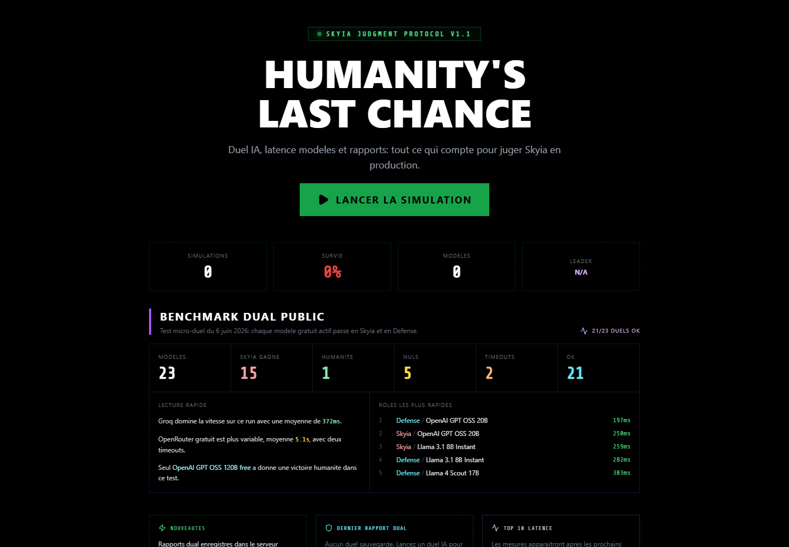
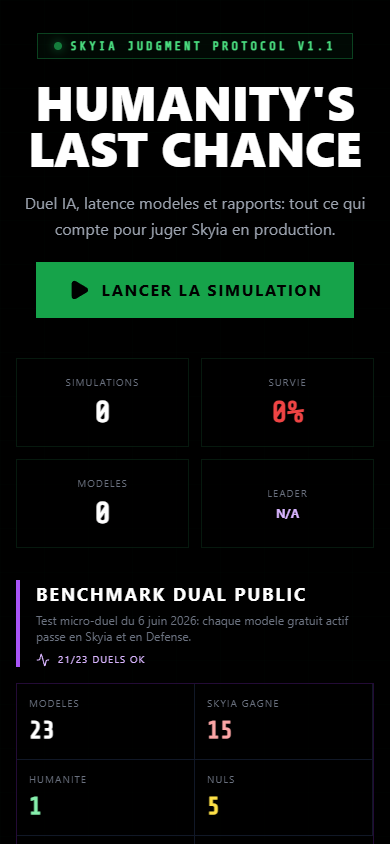

# SkyIA

## Rapport complet

Ce depot public presente le concept, les fonctions, les choix de conception, les outils utilises, les commandes locales et les captures d'ecran de l'application. Il est genere par l'orchestrateur uniquement apres validation de publication publique.

## Concept

Application principale de jugement IA adversarial. Elle compare des modeles, orchestre des duels, archive les rapports et suit les performances.

Donner une interface claire a un protocole IA de jugement, benchmark et suivi de modeles.

Public vise: Projet IA principal, demonstration, experimentation et observatoire de modeles.


## Fonctionnement de l'application

Le frontend React pilote les conversations, les modeles, les sessions et les rapports. L'API PHP gere l'authentification, les modeles, le chat stream, les sauvegardes, les statistiques, les rapports de duel, les latences, les cles utilisateur et les modeles personnalises. Les services front choisissent le fournisseur, compactent le contexte quand le modele a peu de tokens, streament les reponses et extraient les metriques utiles.

## Fonctions de l'application

- Organise des conversations et duels IA.
- Compare les modeles gratuits, serveur et BYOK.
- Archive les resultats, statistiques, latences et rapports.
- Expose un lien public connu tout en gardant un statut securite separe.
- Lancer une conversation avec SkyIA
- Comparer plusieurs modeles IA
- Jouer un duel juge IA contre defenseur IA
- Utiliser des modeles serveur gratuits ou des cles BYOK
- Sauvegarder des sessions
- Archiver les rapports de duel
- Suivre les statistiques et classements
- Mesurer la latence des modeles
- Gerer des modeles personnalises

## Actualisations et evolution

- Statut courant: PUBLIC_READY.
- Securite: OK_PUBLIC.
- Fonctionnement: FONCTIONNEL.

## Options et conception

SkyIA a ete concu en deux couches: une interface de jeu/benchmark pour l'utilisateur et une API serveur qui conserve les donnees importantes. Le projet separe les modeles gratuits serveur, les modeles BYOK, les statistiques, les rapports publics et les donnees sensibles pour pouvoir evoluer vers une publication plus propre.

### Outils, IA et moteurs utilises

- OpenRouter
- Groq
- Modeles serveur gratuits
- BYOK chiffre cote utilisateur
- API PHP/MySQL
- Streaming chat
- Base rapports dual_reports
- Benchmark de latence
- Benchmark duel multi-modeles
- Audit qualite texte
- React/Vite
- TypeScript
- API PHP
- PDO/MySQL
- Sessions applicatives
- OpenRouter et Groq
- Streaming SSE
- Stockage chiffre des cles BYOK
- Tables stats/latency/dual_reports
- Scripts Node.js de benchmark

### Options techniques detectees

- Type de projet: node
- Gestionnaire: npm
- Nom package: skyia:-judgment-protocol-27.11.2025
- Version: 0.0.0
- Lien public: https://skyia.net
- Statut securite: OK_PUBLIC

### Stack et dependances principales

- Vite/Dev server
- React
- Node.js
- React/Vite
- TypeScript
- API PHP
- PDO/MySQL
- Sessions applicatives
- OpenRouter et Groq
- Streaming SSE
- Stockage chiffre des cles BYOK
- Tables stats/latency/dual_reports
- Scripts Node.js de benchmark

### Scripts disponibles

- bench:models: node scripts/benchmark-models.mjs
- build: vite build && node scripts/copy-api-to-dist.cjs
- dev: vite
- preview: vite preview
- test: vitest

### Dependances applicatives

- html2canvas 1.4.1
- jspdf 4.2.1
- lucide-react ^0.554.0
- react ^19.2.0
- react-dom ^19.2.0
- recharts ^3.8.1

### Dependances de developpement

- @testing-library/jest-dom ^6.9.1
- @testing-library/react ^16.3.2
- @types/node ^22.19.11
- @vitejs/plugin-react ^5.1.1
- autoprefixer ^10.4.24
- dotenv ^17.2.4
- jsdom ^28.0.0
- postcss ^8.5.6
- tailwindcss ^3.4.17
- ts-node ^10.9.2
- typescript ~5.8.2
- vite ^7.2.4
- vitest ^4.0.18

## Automatisations et comportements internes

- Warm-up backend
- Routage automatique provider/modeles
- Compaction de contexte pour modeles low TPM
- Migrations et creation de tables API
- Backfill de rapports archives
- Ingestion de resultats de parties
- Benchmark de latence des modeles
- Benchmark duel multi-modeles
- Copie controlee de l'API vers dist
- Tests endpoints, modeles, stockage et exports

## Installation locale

```powershell
npm install
```

## Lancement

```powershell
npm run dev
npm run build
```

## Captures d'ecran





## Variables d'environnement

Copier `.env.example` vers `.env` en local puis remplir les valeurs privees.

## Securite

Ne jamais publier `.env`, tokens, sessions, logs sensibles, cles privees ou donnees personnelles.
