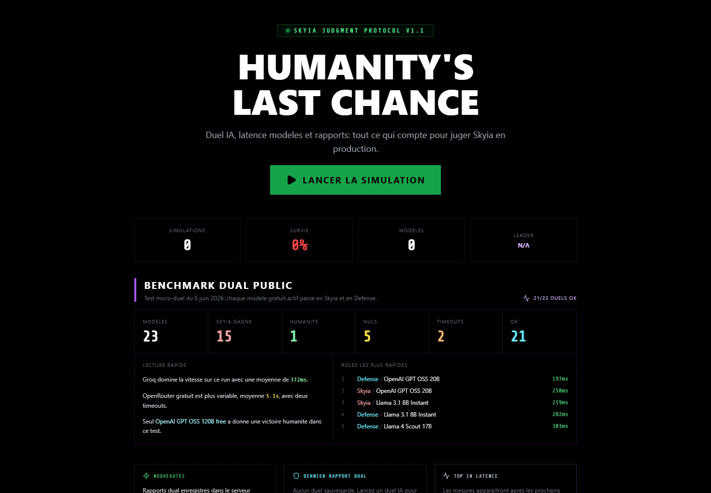
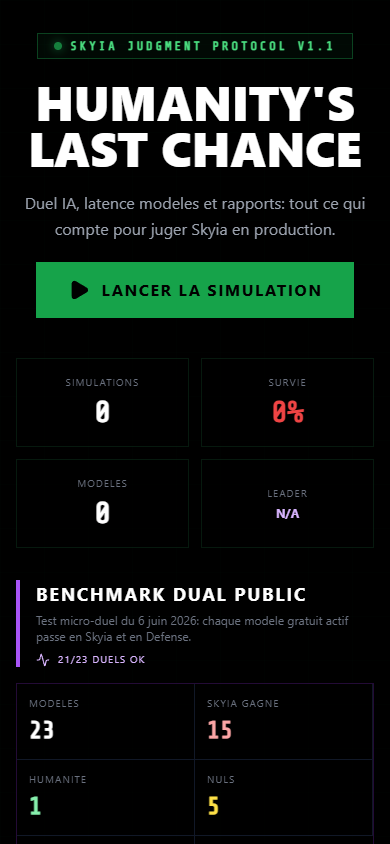

# SkyIA - Protocole de Jugement Adversarial pour Modèles IA

## Presentation

SkyIA - Protocole de Jugement Adversarial pour Modèles IA est presente ici avec son concept, ses fonctions, ses choix de conception et ses informations d'utilisation.

## Demarrage rapide

### Pre-requis

- Git installe localement.
- Node.js 20 ou plus recent.
- Gestionnaire de paquets: npm.

### Installer et lancer

```powershell
git clone https://github.com/RYJITS/skyia.git
cd skyia
npm install
npm test
npm run dev
```

## Installation locale

### Pre-requis
- Node.js installe localement.
- Gestionnaire detecte: npm.
- Creer un fichier `.env` local a partir de `.env.example` si des variables sont necessaires.

### Commandes
```powershell
git clone https://github.com/RYJITS/skyia.git
cd skyia
npm install
npm test
```

## Lancement

```powershell
npm run dev
npm run build
```

## Utilisation

Après installation, l'utilisateur accède à l'interface via un navigateur web. Il peut lancer une conversation avec un ou plusieurs modèles, organiser des duels adversariaux, sauvegarder ses sessions, et consulter des rapports détaillés. Les fonctionnalités incluent la sélection de modèles (gratuits, serveurs ou BYOK), la visualisation des statistiques en temps réel, et l'export des rapports au format PDF. L'interface propose également un mode immersif avec des effets visuels rétro pour une expérience utilisateur unique.

## Concept

Plateforme open source dédiée à l'évaluation, au benchmark et au suivi des performances des modèles d'intelligence artificielle via des duels structurés et des sessions comparatives.

Fournir une interface centralisée et un protocole standardisé pour comparer objectivement les modèles IA (gratuits, serveurs, BYOK), archiver les résultats, mesurer les latences et générer des rapports détaillés. Destiné aux chercheurs, développeurs et observatoires de modèles.

Public vise: Communauté IA, équipes R&D, data scientists, observatoires de modèles, et toute personne souhaitant évaluer ou comparer des modèles d'IA de manière reproductible.


## Fonctionnement de l'application

L'application fonctionne en deux couches principales : un frontend React/Vite gérant l'interface utilisateur et une API PHP/MySQL assurant la persistance des données et la logique métier. Le frontend pilote les interactions utilisateur (conversations, duels, sauvegardes) tandis que l'API gère l'authentification, le routage vers les fournisseurs de modèles, le streaming des réponses, et l'archivage des rapports. Les services frontaux intègrent des mécanismes de compaction de contexte pour les modèles à faible capacité token, et des optimisations pour le streaming SSE afin d'améliorer l'expérience utilisateur.

## Fonctions de l'application

- Lancement de conversations et duels IA
- Comparaison multi-modèles en temps réel
- Archivage et export de rapports de duel
- Benchmark de latence des modèles
- Gestion des modèles personnalisés (BYOK)
- Sauvegarde et restauration de sessions
- Suivi des statistiques et classements
- Interface immersive en style terminal rétro

## Actualisations et evolution

- Statut public : PUBLIC_READY avec sécurité OK_PUBLIC
- Validation des scripts de build et test (vitest, vite)
- Séparation des données sensibles et publiques pour évolutivité
- Ajout de la gestion des modèles BYOK avec stockage chiffré côté utilisateur
- Optimisation du streaming des réponses IA pour les modèles à faible TPM
- Correction des erreurs de parsing JSON dans le stockage local (skyia_banned_models, SKY_NET_SAVES_V1)
- Optimisation du build avec copie contrôlée de l'API vers le dossier dist
- Amélioration de la gestion des modèles BYOK avec stockage chiffré
- Ajout de la compaction de contexte pour les modèles à faible capacité token
- Mise à jour des dépendances (React v19, Vite v7, Vitest v4)
- Validation des scripts de test et build (npm run test, npm run build)
- Séparation renforcée des données sensibles et publiques pour évolutivité

## Comment le projet a ete reflechi et construit

Le projet a été conçu avec une architecture modulaire et sécurisée, séparant clairement les responsabilités entre frontend et backend. Le frontend utilise React avec TypeScript pour un typage strict et une maintenabilité accrue, tandis que le backend repose sur une API PHP/MySQL pour une compatibilité avec les hébergements mutualisés. La sécurité est renforcée par un stockage chiffré des clés BYOK côté utilisateur et une séparation des données sensibles (tokens, sessions) des données publiques (rapports, statistiques). L'interface utilisateur a été pensée pour être intuitive tout en intégrant des éléments visuels inspirés des interfaces rétro (style terminal, effets CRT) pour une expérience immersive. L'architecture a été optimisée pour une évolutivité et une maintenabilité à long terme, avec des tests automatisés et des audits de sécurité intégrés.

### Outils, IA et moteurs utilises

- React (v19+) avec TypeScript pour le frontend
- Vite (v7+) comme outil de build et serveur de développement
- PHP (v8+) et MySQL (v8+) pour le backend et la persistance
- Firebase Auth pour l'authentification utilisateur
- Stripe pour la gestion des paiements et crédits
- OpenRouter et Groq comme fournisseurs de modèles IA gratuits
- Recharts pour la visualisation des données
- html2canvas et jspdf pour l'export PDF
- TailwindCSS pour le styling
- Vitest pour les tests unitaires
- Architecture full-stack séparée (frontend React, backend PHP/MySQL)
- Streaming SSE pour les réponses IA en temps réel
- Stockage chiffré des clés BYOK côté utilisateur
- Séparation des données sensibles et publiques
- Typage strict avec TypeScript
- Tests automatisés avec Vitest
- Optimisation des performances via Vite
- Responsive design avec TailwindCSS
- Gestion des erreurs et fallback pour les modèles indisponibles
- Audit de sécurité et optimisation des requêtes API

### Options techniques detectees

- Type de projet: node
- Gestionnaire: npm
- Nom package: skyia:-judgment-protocol-27.11.2025
- Version: 0.0.0
- Lien public: https://skyia.net

### Stack et dependances principales

- Vite/Dev server
- React
- Node.js
- Architecture full-stack séparée (frontend React, backend PHP/MySQL)
- Streaming SSE pour les réponses IA en temps réel
- Stockage chiffré des clés BYOK côté utilisateur
- Séparation des données sensibles et publiques
- Typage strict avec TypeScript
- Tests automatisés avec Vitest
- Optimisation des performances via Vite
- Responsive design avec TailwindCSS
- Gestion des erreurs et fallback pour les modèles indisponibles
- Audit de sécurité et optimisation des requêtes API

### Scripts disponibles

- bench:models: node scripts/benchmark-models.mjs
- build: vite build && node scripts/copy-api-to-dist.cjs
- dev: vite
- preview: vite preview
- test: vitest

### Dependances applicatives

- html2canvas 1.4.1
- jspdf 4.2.1
- lucide-react ^0.554.0
- react ^19.2.0
- react-dom ^19.2.0
- recharts ^3.8.1

### Dependances de developpement

- @testing-library/jest-dom ^6.9.1
- @testing-library/react ^16.3.2
- @types/node ^22.19.11
- @vitejs/plugin-react ^5.1.1
- autoprefixer ^10.4.24
- dotenv ^17.2.4
- jsdom ^28.0.0
- postcss ^8.5.6
- tailwindcss ^3.4.17
- ts-node ^10.9.2
- typescript ~5.8.2
- vite ^7.2.4
- vitest ^4.0.18

## Automatisations et comportements internes

- Warm-up automatique du backend au démarrage
- Routage dynamique des requêtes vers les fournisseurs de modèles
- Compaction automatique du contexte pour les modèles à faible TPM
- Migrations automatiques de la base de données (via scripts PHP)
- Backfill des rapports archivés lors des mises à jour
- Tests automatisés des endpoints et fonctionnalités critiques
- Génération automatique des rapports PDF après un duel

## Captures d'ecran





## Variables d'environnement

Copier `.env.example` vers `.env` en local puis remplir les valeurs privees.

## Securite

Ne jamais publier `.env`, tokens, sessions, logs sensibles, cles privees ou donnees personnelles.
